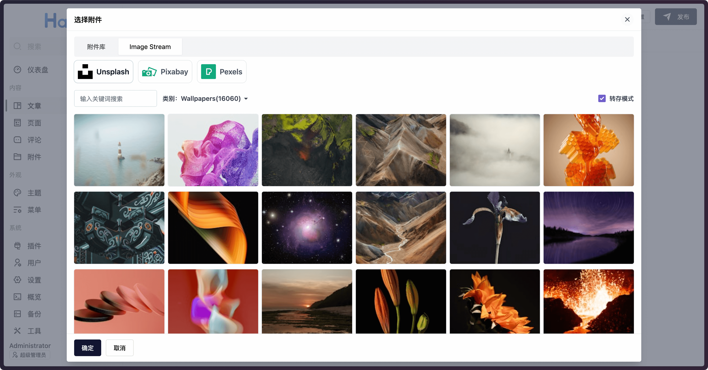

# plugin-image-stream

接入主流的图片资源平台，支持从图片平台选择、转存图片，目前支持：

- [Unsplash](https://unsplash.com/)
- [Pixabay](https://pixabay.com)
- [Pexels](https://www.pexels.com)



> 此插件基于 [plugin-unsplash](https://github.com/halo-sigs/plugin-unsplash)，主要用于支持更多平台，详情见 <https://github.com/halo-sigs/plugin-unsplash/issues/15>

## 特性

- 支持从 Unsplash、Pixabay、Pexels 选择或者转存图片到本地。
- 已内置各个平台的 API Key，开箱即用，也可以配置自己申请的 API Key。
- 可选集成 [MCP Server](https://github.com/halo-dev/plugin-mcp-server)，供 AI Agent 搜索和转存图片。

## 使用

1. 在 [应用市场](https://www.halo.run/store/apps/app-JxVVb) 或 [Releases](https://github.com/halo-sigs/plugin-image-stream/releases) 中下载并安装此插件。
2. 启动之后，在附件选择弹窗中会添加 Image Stream 选项卡。

## MCP Server 集成

安装并启用 MCP Server 1.x 后，Image Stream 会自动提供以下 MCP 工具：

- `image-stream__search_images`：搜索 Unsplash、Pixabay 或 Pexels，并返回统一格式的图片信息。
- `image-stream__prepare_unsplash_download`：登记选中的 Unsplash 图片下载，并返回可供附件转存的链接。

AI Agent 可将选中的图片链接传给 MCP Server 的 `halo_upload_attachment_from_url`，转存到 Halo 附件库。MCP Server 是可选依赖，未安装时不影响 Image Stream 原有功能。

## 配置 API Key

插件已内置各平台的 API Key，开箱即用。如果内置 Key 失效或需要使用自己的 Key，可按以下步骤配置：

1. 进入 Halo 后台 -> 插件 -> Image Stream -> 设置
2. 在对应平台的 Access Key / API Key 栏点击 Secret 输入框，创建一个新的 Secret
3. 填写 Key 和 Value：

| 平台 | Key | Value | 申请地址 |
|------|-----|-------|---------|
| Unsplash | `unsplashApiKey` | 你的 Access Key | https://unsplash.com/developers |
| Pexels | `pexelsApiKey` | 你的 API Key | https://www.pexels.com/api |
| Pixabay | `pixabayApiKey` | 你的 API Key | https://pixabay.com/zh/service/about/api |

4. 保存设置即可生效

## 声明

此插件所提供的内容来自：

- [Unsplash](https://unsplash.com/)：[版权声明](https://unsplash.com/license)
- [Pixabay](https://pixabay.com)：[版权声明](https://pixabay.com/zh/service/license-summary/)
- [Pexels](https://www.pexels.com)：[版权声明](https://www.pexels.com/license/)

## 开发环境

```bash
git clone https://github.com/halo-sigs/plugin-image-stream
```

```bash
cd path/to/plugin-image-stream
```

```bash
./gradlew haloServer
```
