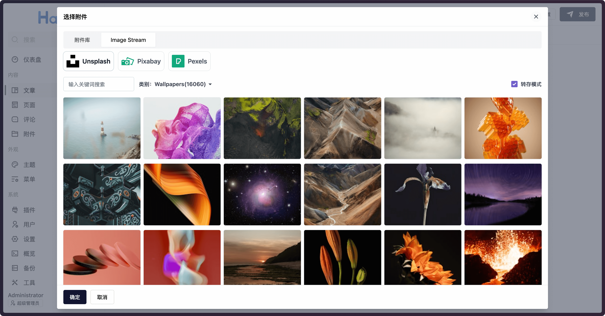

# plugin-image-stream

接入主流的图片资源平台，支持从图片平台选择、转存图片，目前支持：

- [Unsplash](https://unsplash.com/)
- [Pixabay](https://pixabay.com)
- [Pexels](https://www.pexels.com)



> 此插件基于 [plugin-unsplash](https://github.com/halo-sigs/plugin-unsplash)，主要用于支持更多平台，详情见 <https://github.com/halo-sigs/plugin-unsplash/issues/15>

**此项目正在开发中，不能直接使用，实现目标：**

- 同时支持选择图片和提前转存图片再选择。
- 由后端代理图片平台的接口。
- 内置各个平台的 key，且支持自定义 key。
- 处理权限相关的问题。

## 声明

此插件所提供的内容来自：

- [Unsplash](https://unsplash.com/)：[版权声明](https://unsplash.com/license)
- [Pixabay](https://pixabay.com)：[版权声明](https://pixabay.com/zh/service/license-summary/)
- [Pexels](https://www.pexels.com)：[版权声明](https://www.pexels.com/license/)

## 开发环境

```bash
git clone https://github.com/halo-sigs/plugin-image-stream
```

```bash
cd path/to/plugin-image-stream
```

```bash
./gradlew build
```

修改 Halo 配置文件：

```yaml
halo:
  plugin:
    runtime-mode: development
    classes-directories:
      - "build/classes"
      - "build/resources"
    lib-directories:
      - "libs"
    fixedPluginPath:
      - "/path/to/plugin-image-stream"
```
